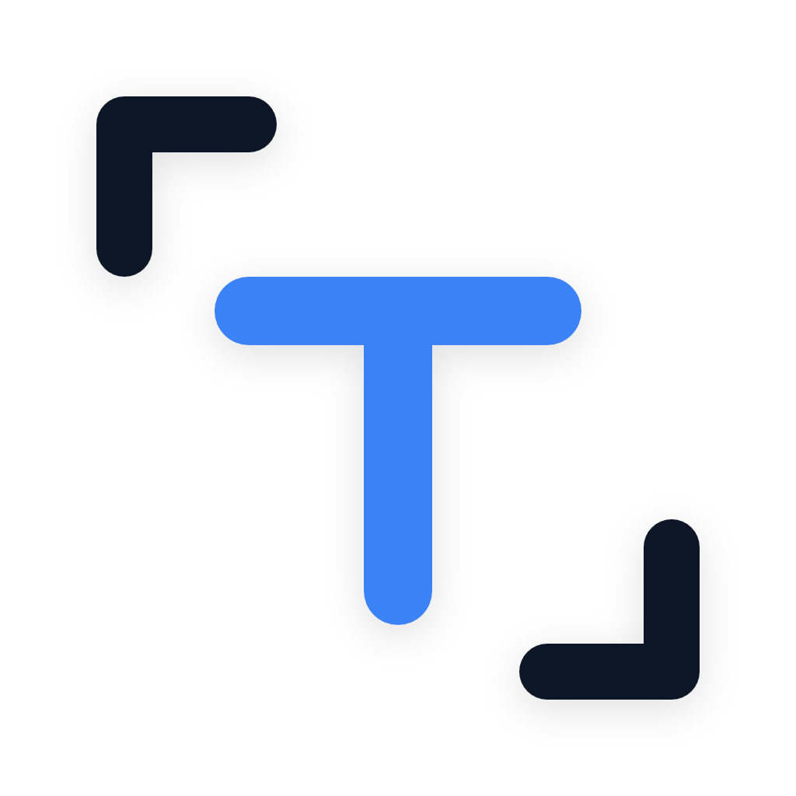
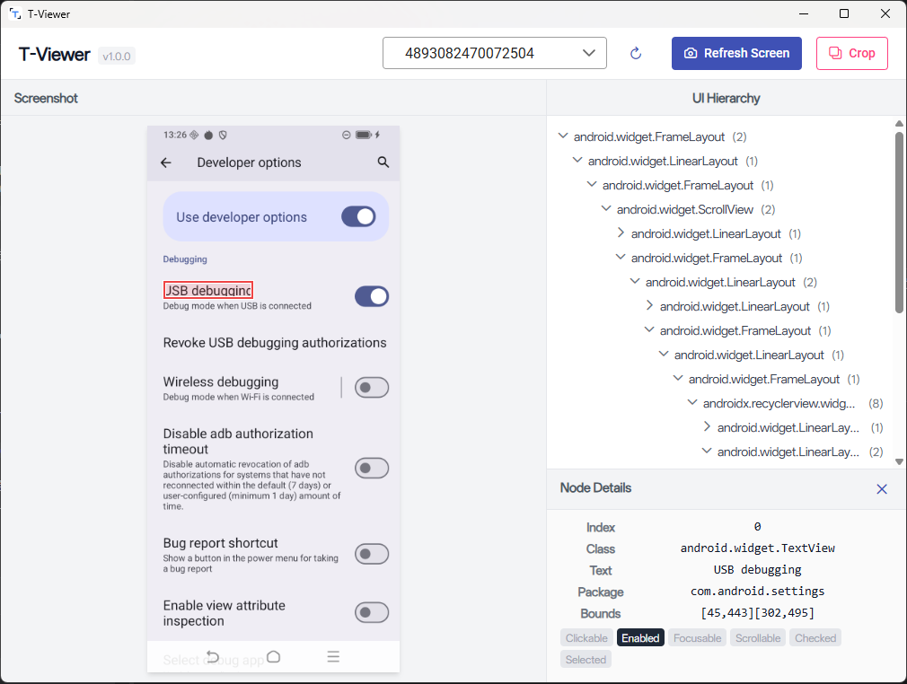
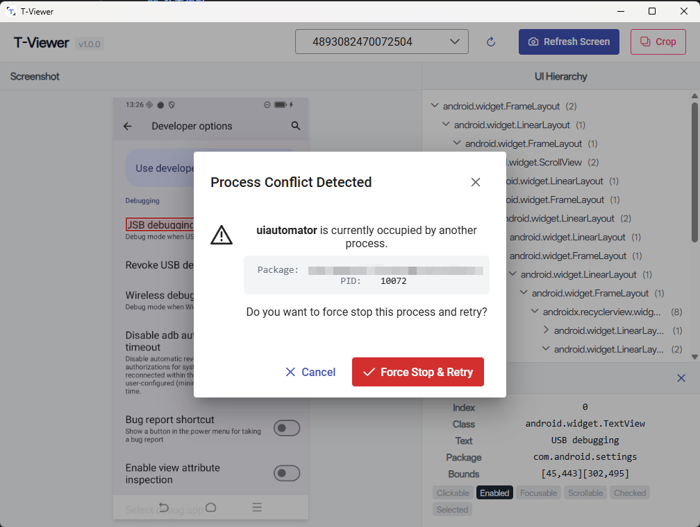

<div align="center">



# T-Viewer

**轻量、高效的 Android UI 调试与分析工具**


</div>

---

T-Viewer 是一款基于 Wails 框架构建的 Android 界面解析工具，用于界面截图抓取与 UIAutomator 层级树的解析。

> **注：目前暂时仅编译发布了 Windows 版本。**

## 技术架构

- **Backend**: Go, Wails
- **Frontend**: Vue 3, TypeScript, Vite

## 快速构建

确保已安装 Go、Node.js 与 Wails CLI，并配置好本地的 ADB 环境。

```bash
# 开发调试
wails dev

# 编译打包生产版本
wails build
```
打包后的可执行文件将生成在 `build/bin/` 目录下。

## 核心工作流

1. 开启 Android 设备的“USB 调试”并连接至电脑。
2. 启动应用，于顶部下拉框选择目标设备。
3. 点击刷新获取当前设备视图。
4. 在左侧画布或右侧树状图中点选节点，查看并提取所需控件属性。

## 界面预览





## 开源协议

本项目基于 [MIT License](../LICENSE) 开源。
